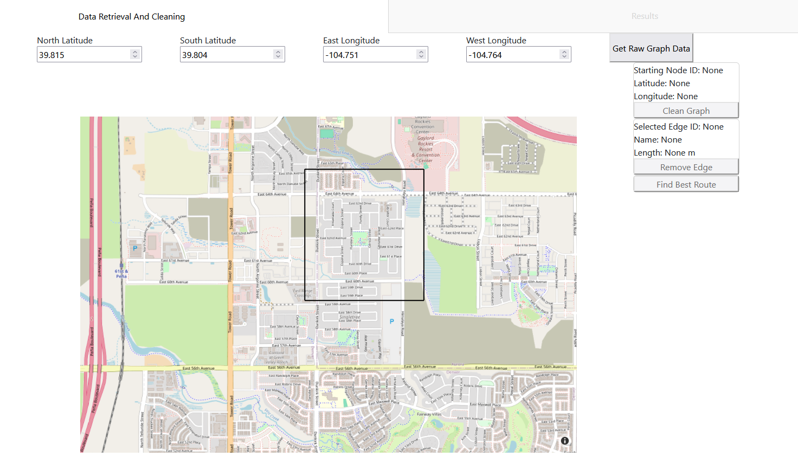
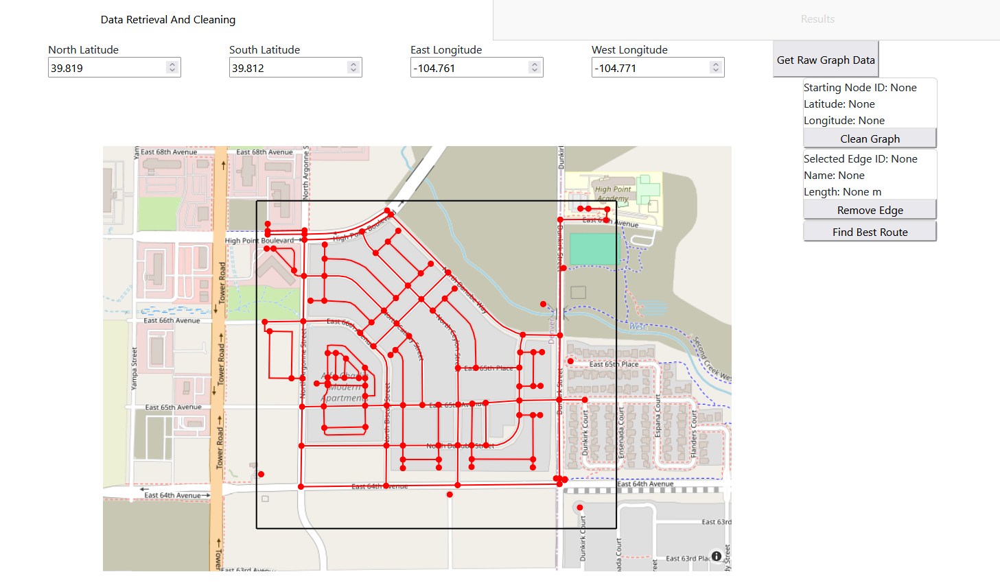
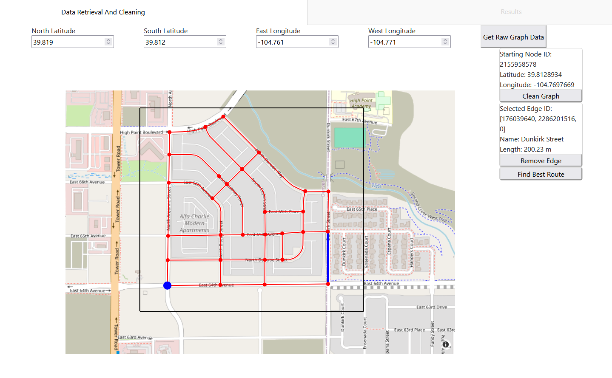
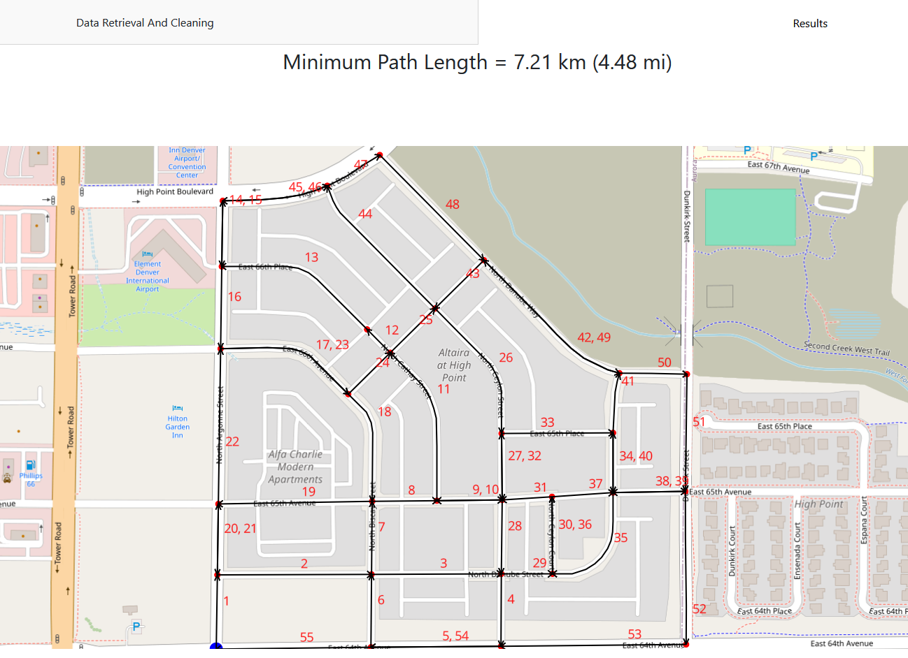

# Bike Routing App

This project was done for CU Boulder DTSA 5506: Data Mining Project.
The purpose of this application is to allow the user to learn the most optimal route to traverse the streets in a region,
going down each street at least once and returning to the starting point. It does so by representing the street network
as a graph data structure and solving the Chinese Postman Algorithm on it.

### Setup

The environment.yml file contains all the packages necessary for running this app.
If you are using conda, an environment for this project can be made by running:

`conda env create -n bike_routing_app -f environment.yml`

in the project folder and then running:

`conda activate bike_routing app`

Once an environment is created, the app is run by simply running `app.py`, which will launch the web
application on `localhost::8050`

### Using the app

When the app is first launched, it will start on the "Data Retrieval and Cleaning" tab. 

Using the inputs at the top, you can customize the bounding box that will be used to define the region to analyze.
Once you have selected a region, press the "Get Raw Graph Data" button on the top right to retrieve a graph of the street network.
It will be displayed over the map. 

The following features exist to help you clean up this raw graph to isolate the exact streets you want to analyze in the region

* Clicking on a node will select it, highlighting it in blue and displaying information about it on the right. The selected node is treated as the starting node for the route
* Clicking on an edge will select it, highlighting it in blue and displaying information about it on the right.
* The selected edge can be deleted using the "Remove Edge Button" if you aren't interested in that street being in the route.
* Pressing the clean graph will perform some automatic cleaning on the graph including:
    * Removing streets that don't have names
    * Removing streets that are unreachable from the highlighted starting nodes

Tip: If there is a region of the graph you are uninterested in including in the route, manually remove edges until it is disconnected from the rest of the graph including the starting node
then run "Clean Graph" and it will be removed

Once you are happy with the streets you want to analyze, hit the "Find Best Route" button, this will analyze the graph
and make a display of the best route available on the "Results" tab at the top. A series of black arrows shows the path
of the optimal route. Each street will have a number next to it, which shows the order the streets are traversed in.
Streets that have more than one number next to them are traversed more than once in the optimal route. The length in both kilometers
and miles of the optimal route is displayed at the top of this tab. 

